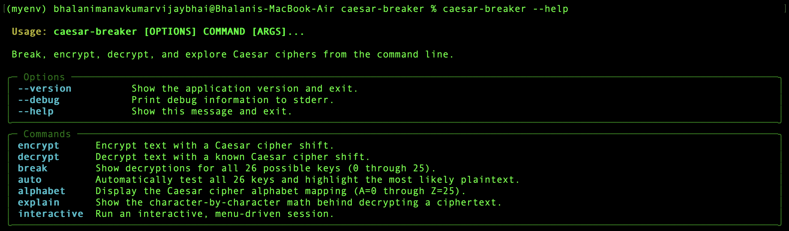
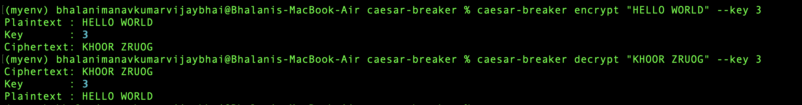
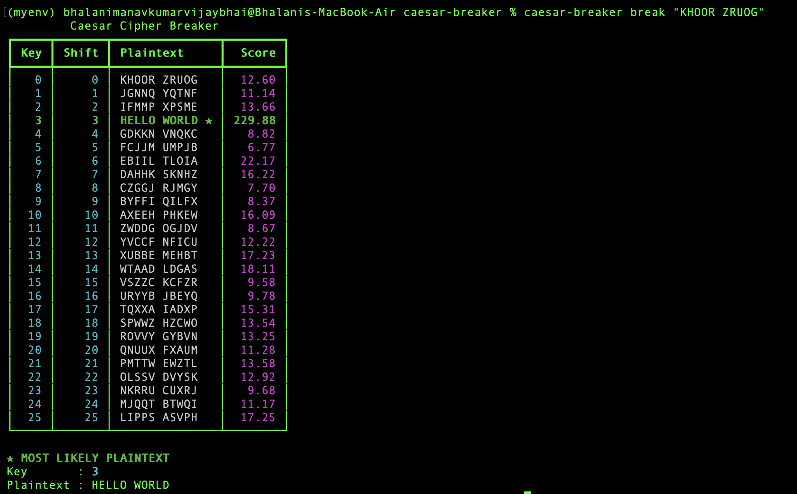
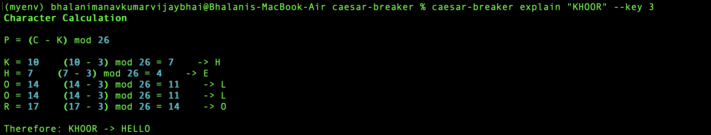

# Caesar Cipher Breaker

A professional, well-tested command-line tool for encrypting, decrypting,
and automatically breaking Caesar ciphers. Built for cryptography
education, CTFs, and authorized security research.

> This project is intended for cryptography education, CTFs, authorized
> security testing, and learning purposes. The Caesar cipher is a
> classical substitution cipher and is not considered secure for
> protecting modern sensitive information.

## Features

- Break Caesar ciphers automatically by testing all 26 keys and scoring
  each result with a heuristic English-language model.
- Encrypt and decrypt with a specified key, including negative keys and
  keys above 25 (normalized with modulo 26).
- Full A-Z alphabet mapping display, plain or as a table.
- Step-by-step math explanation for learning (`explain` command).
- Human, JSON, and CSV output formats.
- Read input directly, from a file, or from stdin.
- Polished terminal output via Rich, with a plain-text fallback for
  non-color terminals.
- Interactive, menu-driven mode.
- Clean error messages (no raw Python tracebacks for normal user errors).
- Cross-platform: macOS, Linux, and Windows.
- Full test suite covering the cipher math, the breaker, and the CLI.

## Mathematical Explanation

```
Encryption:  C = (P + K) mod 26
Decryption:  P = (C - K) mod 26
```

Where `A=0, B=1, ... Z=25`, `P` is the plaintext letter value, `K` is the
key, and `C` is the ciphertext letter value. See
[`docs/mathematics.md`](docs/mathematics.md) for the full explanation,
including a worked example and why modulo 26 makes the alphabet wrap
around.

## Installation

```bash
git clone https://github.com/BhalaniManav/caesar-breaker.git
cd caesar-breaker

python -m venv .venv
```

macOS/Linux:

```bash
source .venv/bin/activate
```

Windows:

```powershell
.venv\Scripts\activate
```

Then:

```bash
pip install -e .
```

Run:

```bash
caesar-breaker --help
```



## Usage

### Encrypt

```bash
caesar-breaker encrypt "HELLO WORLD" --key 3
```

```
Plaintext : HELLO WORLD
Key       : 3
Ciphertext: KHOOR ZRUOG
```

### Decrypt

```bash
caesar-breaker decrypt "KHOOR ZRUOG" --key 3
```

```
Ciphertext: KHOOR ZRUOG
Key       : 3
Plaintext : HELLO WORLD
```



### Show every possible key

```bash
caesar-breaker break "KHOOR ZRUOG"
```

Displays a table with all 26 keys (0 through 25) and marks the most
likely plaintext with a star. Nothing is hidden - every key is always
shown.



### Automatic analysis

```bash
caesar-breaker auto "KHOOR ZRUOG"
```

### Direct input (no subcommand needed)

You can also skip the `break` keyword and pass ciphertext straight in:

```bash
caesar-breaker "KHOOR ZRUOG"
```

This runs the same full 26-key breakdown as `caesar-breaker break "KHOOR ZRUOG"`.

### Explain the math

```bash
caesar-breaker explain "KHOOR" --key 3
```


Walks through the calculation for every character, for learning
purposes.

### Alphabet mapping

```bash
caesar-breaker alphabet
caesar-breaker alphabet --table
```

## CLI Commands

| Command       | Purpose                                            |
|---------------|-----------------------------------------------------|
| `encrypt`     | Encrypt text with a given key                      |
| `decrypt`     | Decrypt text with a given key                      |
| `break`       | Show all 26 possible decryptions                   |
| `auto`        | Automatic analysis, highlighting the best guess     |
| `alphabet`    | Show the A-Z to 0-25 mapping                        |
| `explain`     | Step-by-step math for a given key                   |
| `interactive` | Menu-driven interactive session                     |

Every command supports `--help` for full option details.

## File Input

```bash
caesar-breaker break --file examples/sample_ciphertexts.txt
```

## stdin Input

```bash
echo "KHOOR ZRUOG" | caesar-breaker break
```

## JSON Output

```bash
caesar-breaker break "KHOOR" --format json
```

```json
{
  "cipher": "KHOOR",
  "alphabet_size": 26,
  "results": [
    { "key": 0, "plaintext": "KHOOR", "score": 10.18 },
    { "key": 3, "plaintext": "HELLO", "score": 240.16 }
  ],
  "best_key": 3,
  "best_plaintext": "HELLO"
}
```

All 26 keys are included in the `results` array.

## CSV Output

```bash
caesar-breaker break "KHOOR" --format csv
```

```csv
key,shift,plaintext,score
0,0,KHOOR,10.18
1,1,JGNNQ,4.51
...
```

## Interactive Mode

```bash
caesar-breaker interactive
```

Presents a menu for encrypting, decrypting, breaking, running automatic
analysis, or viewing the alphabet mapping, without needing to remember
CLI flags.

## Architecture

The codebase separates cipher math, breaking/scoring, and presentation
into distinct modules, all built on the same public Python API the CLI
uses internally. See [`docs/architecture.md`](docs/architecture.md) for
the full breakdown.

## Testing

```bash
pip install -e ".[dev]"
pytest
```

The test suite covers encryption, decryption, key 0, key 25, wraparound,
case preservation, spaces, punctuation, all-26-candidates generation,
known-ciphertext breaking, and the CLI commands themselves (including
JSON/CSV output and error handling).

## Supported Platforms

- macOS
- Linux
- Windows

File paths are handled with `pathlib.Path` throughout, so there are no
hard-coded path separators.

## Limitations

- Automatic key detection is heuristic. It combines common-word matches,
  English letter-frequency similarity, and common bigram/trigram
  matches, and works well on real English sentences of reasonable
  length. On very short or unusual ciphertexts, it can pick the wrong
  key - which is why every candidate is always shown, not just the
  top guess.
- Only the classical single-shift Caesar cipher is supported (not
  Vigenere or other polyalphabetic ciphers).
- Only ASCII alphabetic characters are shifted; everything else passes
  through unchanged.

## License

MIT. See [`LICENSE`](LICENSE).

---
